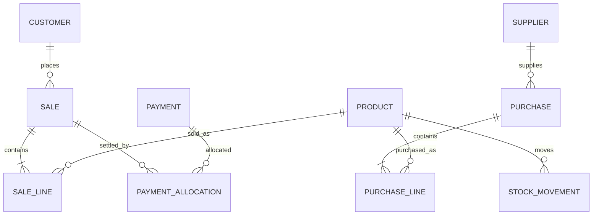

# Planned ERD (conceptual)

```mermaid
erDiagram
  CUSTOMER ||--o{ SALE : places
  SALE ||--|{ SALE_LINE : contains
  PRODUCT ||--o{ SALE_LINE : sold_as
  SUPPLIER ||--o{ PURCHASE : supplies
  PURCHASE ||--|{ PURCHASE_LINE : contains
  PRODUCT ||--o{ PURCHASE_LINE : purchased_as
  SALE ||--o{ PAYMENT_ALLOCATION : settled_by
  PAYMENT ||--o{ PAYMENT_ALLOCATION : allocated
  PRODUCT ||--o{ STOCK_MOVEMENT : moves
```

This is a conceptual illustration only. Entity names and cardinalities must be reviewed before implementation. It is not the actual Prisma schema.
